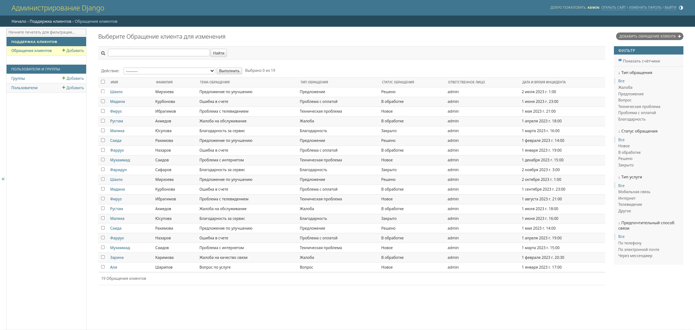
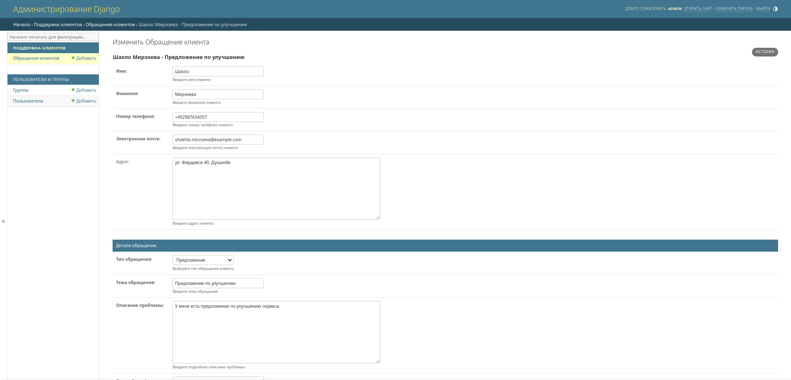
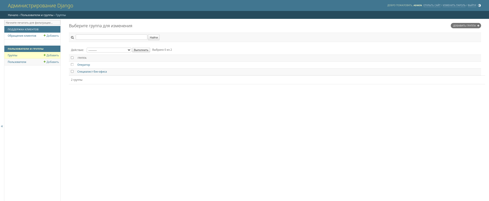

# Django CRM

### Clone and setup

- Clone the repository
- copy the `.env.example` file to `.env` and update the values

## Installation without docker

- #### Requirements
    - Python 3.12+
    - Postgres 13.0+

- #### Create a virtual environment
    - `python3 -m venv venv`
    - `source venv/bin/activate`
    - `pip install -r requirements.txt`

- #### Run the migrations
    - `python manage.py migrate`
    - `python manage.py runserver`

- ### Default superuser
    - username: `admin`
    - password: `admin`

## Installation with docker

- #### Requirements
    - Docker 27.3+
    - Docker-compose 2.31+
- #### Run `docker-compose up --build`

### Usage

- #### Navigate to `http://0.0.0.0/admin` to access the customer request

- #### customer request form

- #### Defaults group

